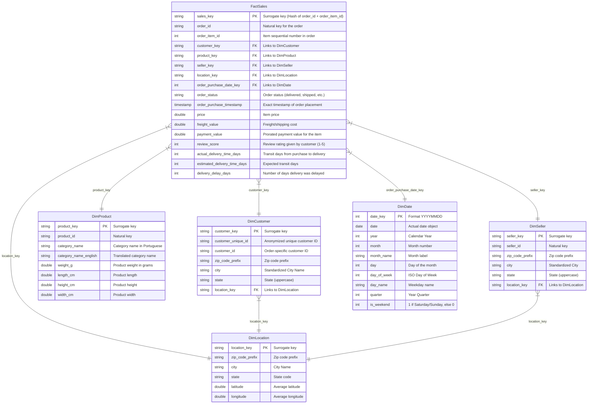

# System Architecture and Data Dictionary

This document details the architecture, data models, and schemas for the Retail Data Platform.

## Pipeline Architecture Diagram

```
[ Raw Landing Zone ] -> (urllib / public mirror)
        │
        ▼ (Auto Loader / Spark Structured Streaming)
[ Bronze Layer (Delta) ] -> raw_customers, raw_orders, raw_products, etc.
        │
        ▼ (Standardizations, Casts, Dedupes)
[ Silver Layer (Delta) ] -> customers, orders, products, order_items, payments, reviews, geolocation
        │
        ▼ (Star Schema Modeling & Surrogate Keys)
[ Gold Layer (Delta) ]  -> FactSales, DimCustomer, DimProduct, DimSeller, DimDate, DimLocation
```

## Entity Relationship Diagram (Gold Layer Star Schema)



---

## Data Dictionary (Gold Layer)

### Table: `FactSales`
| Column | Data Type | Key | Description |
|---|---|---|---|
| `sales_key` | STRING | PK | Surrogate primary key generated via `SHA2(order_id + order_item_id)`. |
| `order_id` | STRING | | Natural key representing the order. |
| `order_item_id` | INT | | Sequential number identifying the item line in the order. |
| `customer_key` | STRING | FK | Links to `DimCustomer`. |
| `product_key` | STRING | FK | Links to `DimProduct`. |
| `seller_key` | STRING | FK | Links to `DimSeller`. |
| `location_key` | STRING | FK | Links to `DimLocation`. Maps to the customer's location. |
| `order_purchase_date_key` | INT | FK | Links to `DimDate`. Represents date of order purchase. |
| `order_status` | STRING | | Standardized lower-case status of the order. |
| `order_purchase_timestamp` | TIMESTAMP | | Exact timestamp when the order was placed. |
| `price` | DOUBLE | | Price of the individual item sold. |
| `freight_value` | DOUBLE | | Freight/shipping costs associated with the item. |
| `payment_value` | DOUBLE | | Total payment value prorated to the item based on price contribution. |
| `review_score` | INT | | Average rating left by the customer (1 to 5). |
| `actual_delivery_time_days` | INT | | Actual days between purchase and delivery. |
| `estimated_delivery_time_days` | INT | | Estimated days between purchase and predicted delivery. |
| `delivery_delay_days` | INT | | Number of days delivery exceeded estimated delivery date (0 if on-time/early). |

### Table: `DimCustomer`
| Column | Data Type | Key | Description |
|---|---|---|---|
| `customer_key` | STRING | PK | Surrogate primary key generated via `SHA2(customer_unique_id)`. |
| `customer_unique_id` | STRING | | Persistent unique ID identifying the customer across visits. |
| `customer_id` | STRING | | Transactional customer ID unique per order session. |
| `zip_code_prefix` | STRING | | Customer zip code prefix. |
| `city` | STRING | | Standardized customer city (Initcap format). |
| `state` | STRING | | Two-letter state code (Uppercase). |
| `location_key` | STRING | FK | Links to `DimLocation` coordinates. |

### Table: `DimProduct`
| Column | Data Type | Key | Description |
|---|---|---|---|
| `product_key` | STRING | PK | Surrogate primary key generated via `SHA2(product_id)`. |
| `product_id` | STRING | | Natural product identifier. |
| `category_name` | STRING | | Original category name in Portuguese. |
| `category_name_english` | STRING | | Translated category name in English (defaults to Portuguese if no mapping exists). |
| `weight_g` | DOUBLE | | Product weight in grams (nulls set to 0.0). |
| `length_cm` | DOUBLE | | Product length in centimeters. |
| `height_cm` | DOUBLE | | Product height in centimeters. |
| `width_cm` | DOUBLE | | Product width in centimeters. |
